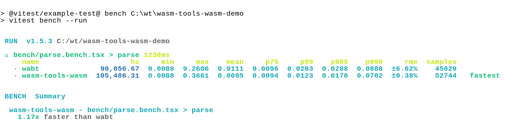

## bench

### nodejs
<div align="center">
	<a href="https://github.com/ahaoboy/neofetch">
		
	</a>
</div>

### web
```

 RUN  v1.5.2 /home/projects/github-rx6rkd

 ✓ bench/parse.bench.tsx > parse 1321ms
     name                    hz     min      max    mean     p75     p99    p995    p999      rme  samples
   · wabt             27,076.00  0.0150  13.2150  0.0369  0.0300  0.0750  0.1600  2.7150  ±10.42%    13538
   · wasm-tools-wasm  65,343.39  0.0000   4.7650  0.0153  0.0150  0.0200  0.0250  0.3350   ±3.38%    32673   fastest


 BENCH  Summary

  wasm-tools-wasm - bench/parse.bench.tsx > parse
    2.41x faster than wabt


```
